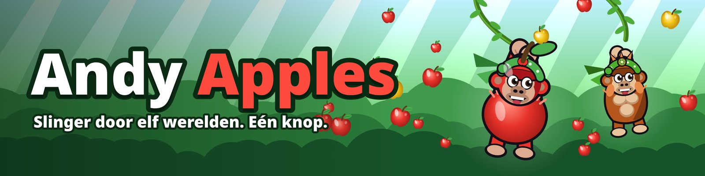

# 🍎 Andy Apples

Een 2D-slingerspel in de browser. Andy de gorilla zwaait aan lianen door vijftien werelden, verzamelt appels en probeert zo ver mogelijk te komen. Alles (graphics, muziek, geluid en physics) wordt in code gemaakt: geen plaatjes, geen geluidsbestanden, geen installatie.

**[▶ Speel online](https://stijnbarendse.nl/appel)**

## Inhoud

- [Spelen](#spelen)
- [Besturing](#besturing)
- [Gamemodes](#gamemodes)
- [Het spel](#het-spel)
- [Multiplayer](#multiplayer)
- [Instellingen](#instellingen)
- [Voortgang en saves](#voortgang-en-saves)
- [Voor ontwikkelaars](#voor-ontwikkelaars)
- [Supabase instellen](#supabase-instellen)

## Spelen

- **Online**: open de [link hierboven](https://stijnbarendse.nl/appel). Werkt het best in Chrome; in Firefox loopt het op sommige apparaten minder soepel.
- **Lokaal**: open `index.html` in een browser. Houd het bestand bij de mappen `css/` en `js/`. Internet is alleen nodig voor online multiplayer, accounts en de ranglijst.
- **Android-app**: [`android/AndyApples.apk`](android/AndyApples.apk) (Android 7.0+, schermvullend en liggend). Ook te downloaden via de knop **App** in het hoofdmenu van het spel (die haalt de nieuwste versie van `main` op GitHub; het adres staat in `apkUrl` in `js/config.js`). Installeren en zelf bouwen: zie [`android/README.md`](android/README.md).

## Besturing

Het hele spel werkt met één knop.

| Actie | Toetsenbord | Muis / touchscreen |
| --- | --- | --- |
| Springen, aan een liaan hangen | `Spatie` ingedrukt houden | scherm ingedrukt houden |
| Loslaten en wegspringen | `Spatie` loslaten | loslaten |
| Duiken (in de lucht) | `Spatie` ingedrukt houden | scherm ingedrukt houden |
| Liaan grijpen | ingedrukt houden terwijl je een liaan raakt | idem |
| Pauze | `P` of `Esc` | ❚❚-knop |

Laat los als Andy naar voren zwaait. Alleen in het water (of de lava, …) vallen is game over.

## Gamemodes

- 🏁 **Carrière**: 15 werelden (één per biome) met elk 8 levels op een **3D-wereldkaart**, zoals in *New Super Mario Bros.* Zie [Carrière](#carrière).
- ♾️ **Eindeloos**: kom zo ver mogelijk. Na een korte, rustige start-animatie (de knoppen schuiven weg en Andy trommelt op zijn borst, zonder zoom) begint de run. Het wordt geleidelijk lastiger en iets sneller (tot een plafond). Met een account kom je met je gebruikersnaam op de online ranglijst.
- 👥 **Gamemodes**: Multiplayer (online tot 20 spelers), Duel (met z'n tweeën op één scherm), Tegen Kiwi en Achtervolging. Zie [Multiplayer](#multiplayer).

## Carrière

- **Wereldkaart**: elke wereld is een groot 3D-eiland in de stijl van zijn biome, schuin van boven gezien, met een kronkelend pad langs de levels, halverwege een **toren** en aan het eind het **kasteel** van de baas. Op het eiland staan bomen, bergen (of een vulkaan, blokkenbergen, piramides, snoepheuvels), een meer, rotsen, bloemen, huisjes, kristallen, lolly's of portalen, en er vliegen vogels over. Andy is op de kaart een 3D-model (met je vachtkleur, hoed of kostuum) dat loopt, huppelt, zwaait en juicht. Andy loopt over het pad: tik op een stip (of gebruik ◀ ▶) om erheen te lopen, en op **Spelen** (of nog eens op de stip) om het level te starten. Met ◀ Wereld ▶ spring je naar een eerdere wereld. **Rondkijken**: sleep met de linkermuisknop (of je vinger) over de kaart; in- en uitzoomen met het scrollwiel of door te knijpen. Op een telefoon werkt alles met tikken.
- **Filmpjes**: haal je een level, dan vult het pad zich op de kaart tot het volgende level en loopt Andy erheen. Versla je de baas, dan krijg je *Wereld voltooid!*, vaar je over zee naar het volgende eiland en verschijnt de nieuwe wereld met zijn naam.
- **Laadscherm**: kies je een level, dan springt Andy, zoomt de camera in en sluit een cirkel zich rond hem. Daarna komt een laadscherm met een ronddraaiende 3D-Andy, de gegevens van het level, een tip en een voortgangsbalk.
- **Tijdslimiet**: elk level heeft een maximale tijd (bovenin beeld, rood in de laatste 20 seconden). Tijd op = level mislukt.
- **Steeds lastiger**: latere levels zijn langer, hebben grotere gaten, meer vijanden en lastige lianen, lopen tot 25% sneller en geven relatief minder tijd.
- **Upgrades tellen maar voor een deel**: in de carrière zijn je upgrades veel zwakker (ongeveer een derde van hun kracht), zodat een volledig ge-upgradede Andy niet door de levels heen walst. De levels schalen daar een beetje op mee: iets grotere gaten, iets minder tijd, snellere bazen en met bijna alles gekocht maar 2 harten tegen de baas. Op de kaart zie je hoe zwaar een level is (●●●○○).
- **De toren** (level 4 van elke wereld): hier klim je omhoog in plaats van vooruit. Je staat onderaan een grote, ronde stenen toren en slingert via lianen die als een pad om de toren heen omhoog lopen naar de vlag bovenop (5 tot 10 verdiepingen). Tussen de verdiepingen lopen stenen ringen om de toren: daar landen en vanaf springen, en ze vangen je op als je valt. De toren en het landschap eromheen zijn 3D en draaien mee als je om de toren heen klimt, en hoe hoger je komt, hoe verder de grond onder je ligt; het spelen zelf blijft 2D. Ondertussen vallen er bloempotten, stenen, tonnen en kisten naar beneden (een rode pijl bovenin waarschuwt): een treffer kost 3 seconden en slaat je van je liaan.
- **Het kasteel** (het baaslevel): een kasteelzaal boven een lavameer, met boogramen waardoor je de wereld buiten ziet, fakkels en vaandels. Je slingert aan kettingen in plaats van lianen, langs grote zwaaiende bijlen, lavageisers (eerst borrelt de lava), pletblokken met punten en een plafond vol punten (te hoog springen doet pijn). Ondertussen valt de baas je aan.
- **Modifiers** (level 3 en 6 van elke wereld): een level met een gekke regel. 🪨 *Zware Andy* (je valt veel sneller), 🌙 *Maanzwaartekracht* (je zweeft ver), 🦍 *Reuzen-Andy* (groot, lange armen, zwaar), 🐜 *Mini-Andy* (klein, korte armen, licht), 🏀 *Stuiterbal* (het water kaatst je terug, maar dat kost 4 seconden) en ⚡ *Hyperspeed* (alles gaat sneller).
- **Uitdagingen** (vanaf level 3, in de gewone levels; in latere werelden en met veel upgrades soms twee tegelijk): 🍎 *Appeljacht* (pak genoeg appels vóór de finish), 💨 *Tegenwind*, 🌫️ *Mist* (je ziet maar een klein stukje), 🪵 *Rotte boel*, 🐝 *Wespennest* en ⏱️ *Tijdrit* (veel minder tijd).
- **Baasgevechten**: in het kasteel, het laatste level van elke wereld, en echt lastig. De baas (van de Kokosbaron in de jungle tot de Glitchbaas in Neonstad) volgt je, afwisselend vóór en achter je. Hij gooit dingen naar waar je straks bent, laat een regen vallen (rode strepen waarschuwen), duikt op je af (een rode baan waarschuwt), richt een rode laser en schiet je dan **van je liaan af**, schiet de liaan waar je aan hangt (of naartoe vliegt) kapot (een rood vizier waarschuwt) en jaagt je vanaf wereld 3 een tijdje achterna. Elke treffer kost een hart en slaat je van je liaan. Halverwege het level wordt hij **woedend** en valt hij veel vaker aan. Je hebt 3 harten; haal de finish om hem te verslaan.
- **Power-ups** zweven in de levels, in bellen: ⭐ *Onkwetsbaar* (8 s, niets kan je raken), 🧲 *Supermagneet* (12 s), 🪽 *Vleugels* (10 s: je zweeft, en van het water stuiter je terug omhoog), 🚀 *Turbo*, ⏳ *Slowmotion* (7 s: alles, ook de klok, gaat half zo snel) en ⏰ *+20 seconden*.

## Het spel

### Werelden

Hoe verder je komt, hoe meer gaten tussen de lianen, hoe meer vijanden en hoe minder appels, maar ook hoe meer elke appel waard is.

| | Wereld | Vanaf | Wat is er anders | Appelbonus |
| --- | --- | --- | --- | --- |
| 1 | 🌿 Jungle | 0 m | het begin | — |
| 2 | 🐸 Moeras | 600 m | wespen, rotte lianen | +0,25 |
| 3 | 🦒 Savanne | 1450 m | meer rotte en elastieken lianen | +0,5 |
| 4 | ❄️ IJsbergen | 2450 m | gladde ijslianen, eksters | +0,75 |
| 5 | 🌋 Vulkaan | 3700 m | vuurballen uit de lava | +1 |
| 6 | 🌙 Sterrennacht | 5200 m | alles door elkaar | +1,5 |
| 7 | 🌀 Portaalwoud | 6600 m | portalen: blauw in, oranje uit, met al je vaart | +2 |
| 8 | 🟩 Kubuswoud | 8000 m | alles van blokjes, zoals *Minecraft* | +2,5 |
| 9 | 🖍️ Tekenland | 9400 m | alles getekend, zoals in *Paint* | +3 |
| 10 | 🧊 3D-wereld | 10800 m | low-poly bergen, neonraster, retrozon | +3,5 |
| 11 | 🍭 Snoepland | 12300 m | lollybomen, zuurstoklianen, een chocoladerivier | +4 |
| 12 | 🏜️ Woestijn | 13800 m | cactussen, piramides, drijfzand, gieren | +4,5 |
| 13 | 🍄 Paddenstoelenbos | 15300 m | reuzenpaddenstoelen, heel veel stuiterzwammen, gloeiende sporen | +5 |
| 14 | ☁️ Wolkenrijk | 16800 m | wolkenbomen, gouden lianen, onweer onder je | +5,5 |
| 15 | 🌃 Neonstad | 18300 m | neonpalmen, een skyline, gloeiende lianen en een neonzee | +6 |

De appelbonus komt bovenop de upgrade Appeloogst.

- **Na Neonstad** komen de werelden steeds terug, elk 1400 m lang, in een vaste, door elkaar gehusselde volgorde (je blijft dus nooit in dezelfde wereld). Appels tellen daar minstens +6.
- **Een nieuwe wereld**: elke wereld is een eiland. Op de grens houdt het eiland op met een rotsige kaap, en daarna is er alleen nog lucht en open zee onder je (met in de verte een paar eilandjes), tot aan de kaap van het eiland van de nieuwe wereld met zijn naambord. Boven de zee hangen aan een reuzentak drie enorme lianen. Andy grijpt ze vanzelf één voor één, springt van de ene naar de andere (met appels langs de bogen) en wordt na de laatste met extra vaart de nieuwe wereld in geslingerd. Je hoeft niets te doen; het duurt zo'n 5 seconden, met filmbalken, een titelkaart en een eigen geluid per wereld. Rond de grens is een rustige buffer: geen vijanden en geen lastige lianen.

### Lianen en extra's

- **Speciale lianen**: ✨ turbo (extra vaart), 🎀 elastiek (rekt en veert), 🍎 fruit (vol appels), 🪵 rot (breekt na even hangen), 🧊 ijs (je glijdt omlaag).
- **Trampolines en stuiterzwammen** lanceren je omhoog.
- **Trucs**: blijf je lang in de lucht, dan doet Andy salto's en andere kunstjes voor bonusappels, met een zwiepende boog, spiraal, gloeiende ster of snelheidslijnen erachter. Andy rekt en krimpt bij grijpen, loslaten en landen, knippert, ademt en zijn benen slingeren mee met de zwaai.
- **Combo's**: pak snel achter elkaar appels voor extra bonus. Elke 100 m is er een mijlpaal met confetti.
- **Vijanden** (wespen, eksters, vuurballen) laten Andy nooit vallen, maar stelen appels. Die kun je terugpakken. Een helm beschermt je.
- **Luchtballonnen** drijven boven het plafond, met een liaan eronder (+5 🍎).
- **Straaljager**: heel af en toe (Eindeloos, vanaf 150 m) scheurt er een straaljager van achteren over je heen, met een lange liaan die ver naar achteren wappert. Grijp hem (+8 🍎) en je wordt zo'n 5 seconden meegesleurd; daarna laat hij je met flinke vaart los.
- **De ruimte**: in Eindeloos hangt er vanaf 150 m geregeld een pad van drie gouden ballonnen hoog in de lucht. Pak ze achter elkaar en laat bij de laatste los: dan word je de ruimte in gelanceerd (+25 🍎). Kom je zonder ballonnen heel hoog (bijvoorbeeld van een trampoline), dan trekt de ruimte je ook omhoog. Daar is bijna geen zwaartekracht en houdt een zachte kracht je 35 seconden boven, met steeds nieuwe sterrenlianen, planetoïden, sterappels en een ufo (+15 🍎). Duiken brengt je eerder terug naar beneden.
- **Head-start**: vóór je eerste sprong in Eindeloos koop je met appels een raketvlucht vooruit (250 tot 2000 m).
- **Onder water (een tweede kans)**: val je in het water (niet in lava, niet in multiplayer), dan is er 20% kans dat Andy niet verdrinkt maar ondergaat. Die tweede kans moet je verdienen: je hebt 22 seconden lucht, de **luchtgaten** (bellenzuilen) liggen ver uit elkaar, de rotswanden laten maar een krappe doorgang (sommige schuiven op en neer), tegenstromingen duwen je terug, en kwallen en kogelvissen kosten je 3 seconden lucht. Haal je een luchtgat, dan schiet je omhoog (+15 🍎 en 2 per seconde lucht over); anders verdrinkt Andy.
- **Kisten**: tijdens het spelen hangen er soms kisten 📦 in de lucht (en onder water). Kom je in de buurt, dan vliegt hij naar je toe (je hoeft hem niet precies te raken) en krijg je hem na de run. Je kunt ook een kist **kopen voor 250 🍎** in het kistenscherm. Open ze via **📦 Kisten** in het menu of op het eindscherm: een rij prijzen rolt voorbij (zoals in *Counter-Strike*) en stopt op je buit.

  | Zeldzaamheid | Kans | Wat |
  | --- | --- | --- |
  | Gewoon | 55% | appels of XP (220 of 500) |
  | Ongewoon | 26% | bruine, grijze of witte vacht, petje, feesthoedje, hartjesspoor, **kiwikostuum** (je ziet eruit als Kiwi) |
  | Zeldzaam | 12,5% | blauwe, roze of groene vacht, cowboyhoed, piratenhoed, hoge hoed, koksmuts, sterrenspoor, **Syntaxis-vacht**, **Syntaxis-pet** |
  | Episch | 5% | gouden of paarse vacht, kroon, tovenaarshoed, vikinghelm, vuurspoor, astronautenpak, **binair spoor** |
  | Legendarisch | 1,5% | **appelkostuum**, regenboogvacht, aureool, regenboogspoor, **Syntaxis-hoodie** |

  De **S.V. Syntaxis-set** heeft het groene S.V.-logo: een donkere vacht met binaire plukjes, een pet met het logo, een hoodie met het logo op de borst en een spoor van groene nullen en enen. Een **spoor** volgt je als je hard gaat. In de **garderobe** (onder de kisten) kies je vachtkleur, hoed, kostuum en spoor, met een voorbeeld van Andy. Heb je iets al, dan krijg je in plaats daarvan appels. Online zien anderen je gewone uiterlijk.

### Upgrades en levels

Met appels koop je 15 permanente upgrades. Ze zijn flink duurder dan vroeger (appels leveren in latere werelden meer op), en elk volgend niveau helpt iets minder dan het vorige: helemaal maximaal werkt een upgrade als ruim 4 van de 5 niveaus. Met XP (vooral voor afstand) stijg je in level en ontgrendel je er meer. Elk niveau van een upgrade is opgedeeld in **3 kleinere stapjes** (behalve de tellers Reddingsballon en Helm): een stapje kost ongeveer wat vroeger een heel niveau kostte, dus alles maximaal duurt veel langer zonder dat een aankoop duurder wordt. Oude voortgang wordt omgerekend. De **Appelmagneet** is afgezwakt: hij trekt appels in de buurt aan, maar is geen stofzuiger meer.

| Direct te koop | Ontgrendel je later |
| --- | --- |
| ✋ Lange armen · 🌀 Zwaaikracht · 💨 Lanceerkracht · 🧲 Appelmagneet · 🧺 Appeloogst · 🎈 Reddingsballon · 🦸 Wingsuit | ✨ Gouden appels (level 4) · ⛑️ Helm (6) · 🔥 Comboketting (8) · 🍄 Stuiterzwam (10) · 🌿 Liaankenner (12) · 🦜 Papegaaimaatje (14) · 🌧️ Appelregen (16) · 🚀 Raketstart (20) |

Zwaaikracht en Lanceerkracht verhogen ook je topsnelheid: snelheid moet je verdienen. Maar hoe meer upgrades je hebt, hoe lastiger de wereld: grotere gaten tussen de lianen, vaker een ontbrekende liaan en meer vijanden (in Eindeloos en de carrière; in multiplayer staan upgrades uit).

## Multiplayer

In multiplayer staan upgrades uit, en appels en XP tellen niet mee voor je save. Iedereen speelt in dezelfde wereld en ziet de anderen als extra gorilla's.

**Manieren van spelen**
- **Openbare lobby**: staat altijd bovenaan in **Gamemodes → Multiplayer** en is altijd open. Zodra er 2 spelers zijn, start er vanzelf een ronde (na 15 seconden, en daarna steeds 15 seconden na elke ronde). Iedereen kan stemmen op de volgende spelmodus; de meeste stemmen wint, en zonder stemmen kiest het spel een willekeurige modus.
- **Eigen lobby (tot 20 spelers)**: kies **+ Nieuwe lobby**. Je lobby verschijnt in de lijst van anderen, of je stuurt een uitnodigingslink. De host kiest de spelmodus en start vanaf 2 spelers. Na afloop start de host een nieuwe ronde.
- **Apen (bots)**: in een eigen lobby kiest de host bij **Apen** hoeveel apen er meedoen (1 tot 5) en hoe goed ze zijn (*Makkelijk* t/m *Expert*). Zo kun je ook met z'n tweeën, of alleen, een volle race spelen. Apen doen mee met Race en Endurance, niet met Battle royale. Bij Endurance eindigt de ronde als er geen mensen meer over zijn.
- **Duel** (2 spelers, één scherm): speler 1 speelt met `Spatie` (of de linker/bovenste helft van het scherm), speler 2 met `↑` of `Enter` (of de rechter/onderste helft). Geen internet nodig.
- **Tegen Kiwi (AI)**: een race naar de finish tegen een orang-oetan op niveau *Makkelijk*, *Normaal*, *Moeilijk* of *Expert*.

**Spelmodi**
- **Race**: wie het eerst bij de finish is (500, 1000 of 2000 m), wint. Val je, dan kom je terug op een liaan en verlies je tijd.
- **Endurance** (Multiplayer en Duel): wie het langst volhoudt, wint. Een storm jaagt je op.
- **Battle royale** (online): een kleine arena waar je niet kunt wegvluchten. Iedereen begint op een eigen liaan met een appelkatapult. Pak fruitwapens uit de zwevende bellen (🍌 bananenblaster, 🥥 kokoskanon met hagel, 🍍 ananasbazooka die ontploft, 🍇 druivensniper, ❤️ extra leven), **richt met de muis en klik om te schieten**; grijpen doe je met `Spatie` of de rechtermuisknop (op een telefoon: links op het scherm = grijpen, rechts tikken = schieten op die plek). Zwaaien kan hier alle kanten op, ook naar achteren. Een zware treffer schiet je van je liaan; val je in het water of is je leven op, dan ben je af. Na 40 seconden drukt een storm de arena van beide kanten kleiner. Wie als laatste overblijft, wint; in de uitslag staat ook hoeveel spelers je eruit schoot.
- **Achtervolging** (tegen Kiwi): Kiwi start 3 tellen na jou en wordt steeds sneller. Hoe lang hou je het vol? Je record wordt bewaard.

Online gebruikt het spel Supabase om lobbies te vinden en de verbinding op te zetten. Daarna praten de spelers direct met de host (WebRTC). Lukt dat na 7 seconden nog niet (vaak als spelers op hetzelfde wifi-netwerk zitten), dan loopt het verkeer met die speler vanzelf via Supabase. Dat werkt altijd, maar is iets minder vloeiend. Bij 20 spelers heeft de host een goede verbinding nodig. Er is geen server die het spel draait: ook in de openbare lobby is één van de spelers de host, en gaat die weg, dan neemt een ander het over.

## Instellingen

Instellingen open je met het tandwiel rechtsboven in het hoofdmenu, of in het pauzescherm.

- **Grafische kwaliteit**: een schuifje met *AI* (standaard: het spel meet de framerate en kiest zelf), *Laag*, *Normaal* en *Hoog*. *AI* schakelt alleen terug als dat echt helpt: een telefoon in energiebesparing (vast op 30 fps) houdt dus gewoon mooi beeld. Tekent je browser zonder grafische versnelling, of moet het spel naar de laagste stand, dan krijg je in het menu een melding met een tip.
- **Liggend spelen**: op telefoons standaard aan. Waar het kan wordt het scherm liggend vastgezet; anders draait het spel het beeld zelf een kwartslag. In de Android-app zet je hiermee het liggend vastzetten aan of uit (uit: de app draait mee met je telefoon).
- **Volledig scherm** (ook in de Android-app: de systeembalken weg of terug), **geluid** en **muziek**: los aan en uit te zetten. Geluidseffecten en muziek hebben elk een eigen volumeschuifje.
- **Resetten**: zet de carrière, je cosmetics of je upgrades (zonder appels terug) apart terug naar het begin. Tik eerst op *Reset*, dan nog een keer op *Zeker?* om het te bevestigen.

### Geluid

Alle geluid wordt tijdens het spelen gemaakt met WebAudio (`js/audio.js`):
- Elk effect is opgebouwd uit lagen (een tik, een lichaam en een staart) en klinkt elke keer een klein beetje anders van toonhoogte en volume. Zo wordt het niet eentonig.
- Een limiter voorkomt gekraak als veel geluiden tegelijk klinken, en een gedeelde galm geeft wat ruimte.
- Onder water klinkt alles gedempt, ook de muziek.
- Op één scherm komt speler 1 links uit de luidsprekers en speler 2 (of Kiwi) rechts. Met één speler klinken appels en plonzen een beetje van de kant waar ze op het scherm gebeuren.
- Andy heeft een eigen stem (formantsynthese: een stembron door vijf klinkerfilters, met adem en een ruw randje). Bij een flinke zwaai roept hij een van vijf roepen (*Hoe-hoe-WOE-HOE*, *Wie-HOE*, *Jie-HAA*, *Wa-HOE* of een chimpansee-roep), nooit twee keer dezelfde achter elkaar. Bij een lancering naar de ruimte klinkt een Tarzan-kreet. Verder zegt hij *Hup!* bij de afzet, *Hé!* als er appels gestolen worden, *Whoa!* als hij wegglijdt of een tak breekt, en gorgelt hij als hij verdrinkt. Speler 2 en Kiwi hebben een iets hogere stem.
- In **Debug** staat een geluidsbord waarmee je elk geluid los kunt afspelen.
- Menuknoppen tikken zacht. Een run eindigt met een kort loopje, of met een fanfaretje bij een nieuw record.
- **Debug**: achter het wachtwoord `jungle-debug`. Hier stel je zoom en spelsnelheid in en zet je een FPS-meter aan. Runs met een andere snelheid tellen niet voor de ranglijst.

## Voortgang en saves

- Je voortgang wordt automatisch in de browser bewaard.
- Met een **account** wordt je voortgang ook online bewaard en kun je op een ander apparaat verder. Heb je op beide plekken voortgang, dan vraagt het spel welke je wilt houden.
- Bij **Account** kies je ook een **gebruikersnaam** (uniek, 3–16 tekens: letters, cijfers en `_`). Die zie je op de ranglijst en in multiplayer. Zonder account krijg je in multiplayer een willekeurige naam, die je zelf kunt aanpassen.
- De Android-app heeft een eigen voortgang, los van de browser. Log in met hetzelfde account om die gelijk te houden.

## Voor ontwikkelaars

Er is geen build-stap en geen npm. `index.html` bevat de schermen, `css/style.css` de opmaak, en de code staat in gewone scripts in `js/`:

| Bestand | Wat |
| --- | --- |
| `config.js` | Supabase-instellingen (zie [Supabase instellen](#supabase-instellen)) |
| `data.js` | werelden, upgrades, levels, Kiwi-niveaus, moeilijkheid en tempo: **hier begin je bij uitbreiden of balanceren** |
| `util.js`, `save.js`, `audio.js` | hulpfuncties, opslag, geluid en muziek |
| `view.js`, `world.js`, `physics.js`, `effects.js` | beeld, zoom en kwaliteit; wereldgenerator; lianen en zwaaien; deeltjes |
| `render-bg.js`, `render-world.js` | achtergrond en speelwereld tekenen |
| `model3d.js` | kleine 3D-tekenaar (driehoeken op een 2D-canvas) en Andy als 3D-model |
| `online.js`, `mp-online.js`, `mp-local.js`, `mp-br.js` | Supabase (ranglijst, accounts), online lobbies, één scherm en Kiwi, battle royale |
| `career.js`, `levels.js`, `worldmap.js` | carrière: tijd, uitdagingen, power-ups en bazen in een level; de toren, het kasteel en de modifiers; de 3D-wereldkaart, filmpjes en het laadscherm |
| `game.js`, `main.js` | spelverloop, menu's, invoer en HUD; hoofdlus en opstarten |

- **Testen**: `node tools/smoke.mjs` (Node 18+ en Chrome/Chromium). Klikt door de menu's, speelt alle modi en faalt bij elke JavaScript-fout.
- **Prestaties meten**: `node tools/perf.mjs`. Meet per kwaliteitsniveau en wereld de framerate en rekentijd, en hoeveel geheugen de achtergrond gebruikt. Vergelijk vóór en na een wijziging op dezelfde computer.
- **Android-app bouwen**: zie [`android/README.md`](android/README.md). De APK in de repo wordt niet vanzelf bijgewerkt als het spel verandert.
- **Ander debug-wachtwoord**: reken de nieuwe waarde voor `DBG_HASH` in `js/view.js` uit met:
  ```sh
  node -e "let h=0x811c9dc5;for(const c of 'andy-debug:'+process.argv[1]){h^=c.charCodeAt(0);h=Math.imul(h,0x01000193)>>>0}console.log(h.toString(16).padStart(8,'0'))" NIEUW_WACHTWOORD
  ```
  Dit is een drempel, geen echte beveiliging: alles draait in de browser.

## Supabase instellen

Accounts, online lobbies en de ranglijst gebruiken één gratis [Supabase](https://supabase.com)-project. Zolang dat niet is ingesteld, zijn de knoppen **Account** en **Ranglijst** verborgen. De rest van het spel werkt dan gewoon.

1. Maak een account op supabase.com en een nieuw project (gratis plan, regio in Europa).
2. Open **SQL Editor → New query**, plak dit en klik op **Run**:

   ```sql
   -- ===== Accounts: voortgang online bewaren =====
   create table public.saves (
     user_id    uuid primary key references auth.users (id) on delete cascade,
     data       jsonb not null,
     updated_at timestamptz not null default now()
   );
   alter table public.saves enable row level security;
   create policy "eigen save lezen"    on public.saves for select to authenticated using ((select auth.uid()) = user_id);
   create policy "eigen save maken"    on public.saves for insert to authenticated with check ((select auth.uid()) = user_id);
   create policy "eigen save bijwerken" on public.saves for update to authenticated using ((select auth.uid()) = user_id) with check ((select auth.uid()) = user_id);

   -- ===== Gebruikersnamen: uniek (ook zonder op hoofdletters te letten), 3-16 tekens =====
   create table public.profiles (
     user_id    uuid primary key references auth.users (id) on delete cascade,
     username   text not null check (username ~ '^[A-Za-z0-9_]{3,16}$'),
     updated_at timestamptz not null default now()
   );
   create unique index profiles_username_uniek on public.profiles (lower(username));
   alter table public.profiles enable row level security;
   create policy "eigen naam lezen"    on public.profiles for select to authenticated using ((select auth.uid()) = user_id);
   create policy "eigen naam maken"    on public.profiles for insert to authenticated with check ((select auth.uid()) = user_id);
   create policy "eigen naam wijzigen" on public.profiles for update to authenticated using ((select auth.uid()) = user_id) with check ((select auth.uid()) = user_id);
   grant select, insert, update on public.profiles to authenticated;

   -- ===== Ranglijst (Eindeloos): alleen spelers met een account en een gebruikersnaam =====
   create table public.ranking (
     user_id    uuid primary key references auth.users (id) on delete cascade,
     dist       integer not null check (dist between 0 and 100000),
     updated_at timestamptz not null default now()
   );
   alter table public.ranking enable row level security;  -- geen policies: schrijven kan alleen via submit_run

   create or replace function public.submit_run(p_dist integer)
   returns void language plpgsql security definer set search_path = public as $$
   begin
     if auth.uid() is null then raise exception 'niet ingelogd'; end if;
     if p_dist is null or p_dist < 0 or p_dist > 100000 then raise exception 'ongeldige afstand'; end if;
     insert into public.ranking (user_id, dist) values (auth.uid(), p_dist)
     on conflict (user_id) do update
       set dist = greatest(ranking.dist, excluded.dist),
           updated_at = case when excluded.dist > ranking.dist then now() else ranking.updated_at end;
   end $$;
   revoke all on function public.submit_run(integer) from public, anon;
   grant execute on function public.submit_run(integer) to authenticated;

   -- openbare lijst: alleen naam en afstand (de view leest de tabellen als eigenaar, dus e-mail en id blijven verborgen)
   create or replace view public.leaderboard as
     select p.username as name, r.dist, r.updated_at from public.ranking r join public.profiles p using (user_id);
   revoke all on public.leaderboard from anon, authenticated;
   grant select on public.leaderboard to anon, authenticated;
   ```

   Had je al een eerdere versie ingericht? Voer dan alleen de blokken *Gebruikersnamen* en *Ranglijst* uit. De oude, anonieme ranglijst wordt niet meer gebruikt; die ruim je op met:

   ```sql
   drop function if exists public.submit_score(text, text, integer);
   drop table if exists public.scores;
   ```

3. **Lobbies** hebben geen tabel nodig: ze gebruiken Realtime, dat standaard aan staat. Staat bij **Realtime → Settings** "Allow public access" uit, zet dat dan aan.
4. **Inloggen met e-mail** staat standaard aan. Zet onder **Authentication → URL Configuration** de **Site URL** op het adres van je spel, voor de bevestigingsmail. Geen bevestigingsmail nodig? Zet dan **Confirm email** uit. De ingebouwde mailserver verstuurt maar een paar mails per uur; stel voor meer spelers een eigen mailprovider in onder **Authentication → Emails → SMTP Settings**.
5. Kopieer bij **Project Settings → API Keys** de **Project URL** en de **publishable key** (`sb_publishable_…`, in oudere projecten de **anon public** key). Die mag openbaar in een website staan. Gebruik **nooit** de `service_role`- of secret key.
6. Vul ze in in `js/config.js`:

   ```js
   const CONFIG = {
     supabase: { url: 'https://abcdefgh.supabase.co', key: 'sb_publishable_…' },
     siteUrl: 'https://stoin3.github.io/andy-apple/',   // voor uitnodigingslinks en de bevestigingsmail
   };
   ```

7. Zet het spel online, bijvoorbeeld met **GitHub Pages**: repository → **Settings → Pages** → *Deploy from a branch* → `main` en `/ (root)`.

### Multiplayer via de server

Er hoeft niets extra's ingesteld te worden. Lukt een directe verbinding tussen twee spelers niet, dan gebruikt het spel een eigen Realtime-kanaal per speler op hetzelfde Supabase-project (berichten gebundeld per 0,1 s). Dat telt mee voor de Realtime-berichten van je Supabase-plan; het gratis plan is ruim genoeg voor af en toe een potje.

Wil je dat liever niet? Met een eigen TURN-server lukt een directe verbinding vaker. Zet die in `js/config.js` bij `turn`: een adres dat de ICE-servers teruggeeft, of een vaste lijst, bijvoorbeeld `turn: [{ urls: 'turn:turn.example.com:3478', username: '…', credential: '…' }]`. Dit is niet nodig.

**Goed om te weten**
- Een vergeten wachtwoord kun je (nog) niet in het spel resetten. Dat kan in Supabase bij **Authentication → Users**.
- Op de ranglijst staan alleen spelers met een account en een gebruikersnaam. Helemaal waterdicht is hij niet: een ingelogde speler met technische kennis kan een nepscore insturen. Verwijder die in **Table Editor → ranking**.
